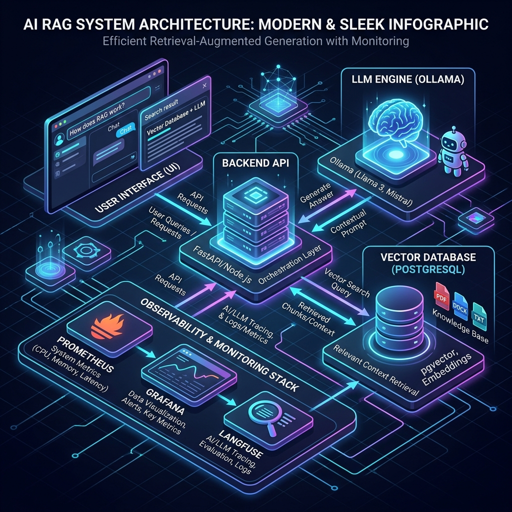

# Simplon RAG Sample

<!-- markdownlint-disable -->
<p align="center">
  <strong>Sample RAG support chatbot — powered by RAG, LangChain, and local Ollama models</strong>
</p>

<p align="center">
  <a href="https://opensource.org/licenses/MIT">
    
  </a>
  <a href="https://python-semantic-release.readthedocs.io/">
    
  </a>
</p>
<!-- markdownlint-restore -->

---

Intelligent support chatbot example, built on a Retrieval-Augmented Generation (RAG) architecture
using LangChain, LangGraph, PostgreSQL/pgvector for vector storage, and local Ollama models for
both embeddings and LLM inference.

## Features

- **Document Ingestion** - PDF upload with SHA-256 deduplication, chunking, and embedding
- **RAG Pipeline** - Semantic retrieval via pgvector cosine similarity + LLM generation
- **LangGraph Agent** - Stateful multi-step graph: routing, retrieval, generation, history
- **Hybrid Architecture** - Ollama runs natively on macOS (Metal GPU) for performance, while the rest of the stack (API, Frontend, Observability) runs in Docker.
- **Streaming Tokens** - Real-time response streaming in the Streamlit UI.
- **Local Ollama** - `qwen2.5-coder:7b` (or `mistral-small3.2`) for generation and `mxbai-embed-large` for embeddings.
- **Full Observability** - Prometheus metrics, Grafana dashboards, Loki logs, and Langfuse tracing.
- **PostgreSQL + pgvector** - HNSW index for fast approximate nearest-neighbour search
- **FastAPI REST API** - 8 endpoints under `/api/v1` for ingestion, chat, and evaluation
- **Ragas Evaluation** - Faithfulness, answer relevancy, and context recall metrics

## Tech Stack

| Category | Technology |
|----------|------------|
| Language | Python >= 3.14 |
| Package Manager | uv |
| LLM Framework | LangChain + LangGraph |
| LLM / Embeddings | Ollama (local) |
| Vector Store | PostgreSQL + pgvector |
| ORM / Migrations | SQLAlchemy (async) + Alembic |
| API | FastAPI + uvicorn |
| RAG Evaluation | Ragas |

## System Architecture & Workflow



This project implements a robust **Retrieval-Augmented Generation (RAG)** pipeline integrated with an industrial-grade **Site Reliability Engineering (SRE) observability stack**. 

**How it works (The Workflow):**
1. **User Interface (Streamlit)**: The user submits a query. The UI generates a unique `trace_id` to track the request throughout the entire system.
2. **Backend API (FastAPI)**: Receives the request and orchestrates the logic using LangGraph.
3. **Knowledge Retrieval (PostgreSQL + pgvector)**: The API queries the vector database for semantically relevant chunks of pre-ingested PDF documents.
4. **LLM Inference (Ollama)**: The retrieved context and user query are sent to a local LLM (e.g., Llama 3 or Qwen) running on GPU to generate an accurate, grounded answer.
5. **Observability & SRE Stack**:
   - **Langfuse**: Captures detailed traces of the LLM execution (prompts, latencies, tokens) and user feedback (👍/👎).
   - **Promtail & Loki**: Centralizes and aggregates structured JSON logs.
   - **Prometheus & Grafana**: Scrapes system metrics (e.g., latency, error rates) every 5 seconds and visualizes them on real-time dashboards.
   - **Alertmanager & Discord**: If metrics breach predefined thresholds (e.g., high latency or error rates), alerts are routed to a Discord channel via a bridge.

## Quickstart with Docker

The fastest way to spin up the full stack (Ollama + PostgreSQL + API + Streamlit UI):

```bash
# 1. Configure the environment
cp api/.env.example api/.env
# Ensure OLLAMA_BASE_URL=http://host.docker.internal:11434 in api/.env

# 2. Ensure Ollama is running natively on your Mac (Download at ollama.com)
# Pull the models:
ollama pull qwen2.5-coder:7b
ollama pull mxbai-embed-large

# 3. Start the stack
docker compose up -d

# 3. Watch model pulling progress (optional)
docker compose logs -f ollama-init

# 4. Open the UI
open http://localhost:8501       # Streamlit chat
# API docs:    http://localhost:8000/docs
# API health:  http://localhost:8000/api/v1/health

# 5. Tear down
docker compose down              # keep data
docker compose down -v           # also drop postgres and ollama volumes
```

For a production-like build (multi-worker uvicorn, no source mounts, postgres
port hidden from the host):

```bash
docker compose -f docker-compose.yml -f docker-compose.prod.yml up -d --build
```

## Local installation (without Docker)

```bash
# Copy and configure environment
cp api/.env.example api/.env
# Edit api/.env with your DB connection and (optionally) Ollama host/models
# Make sure Ollama is running locally: `ollama serve`
# And the models are pulled:
#   ollama pull mistral-small3.2 && ollama pull mistral:latest && ollama pull mxbai-embed-large

# Install API dependencies
cd api
uv sync --extra dev          # dev tools included

# Apply database migrations (requires a running PostgreSQL with pgvector)
uv run alembic upgrade head
cd ..

# Install frontend dependencies
cd frontend
uv sync
cd ..

# Install git hooks
pre-commit install
```

## Usage (local)

```bash
# Run API (from api/)
cd api && uv run python main.py
# API available at http://localhost:8000/api/v1

# Run the Streamlit chat UI (from frontend/)
cd frontend && uv run streamlit run src/app/app.py
# UI available at http://localhost:8501
```

### CLI Tools

Standalone entry points for ingestion and evaluation, runnable without the API
(useful for cron, CI, or one-off scripts). Run from `api/`.

```bash
cd api

# Ingest every PDF in data/docs/ (idempotent via SHA-256)
uv run python -m rag.cli.ingest
uv run python -m rag.cli.ingest --docs-dir path/to/pdfs

# Run Ragas evaluation against data/evaluation/samples.json
uv run python -m rag.cli.eval
uv run python -m rag.cli.eval --samples path/to/samples.json
```

## Development

```bash
# Run API tests (from api/)
cd api && uv run pytest

# Lint all files (from repo root)
uv run pymarkdownlnt scan --recurse .
uv run yamllint .

# Commit (Conventional Commits format)
git commit -m "feat: ..."
```

## Déploiement GCP (production)

| Service | URL |
|---------|-----|
| **API (backend)** | https://simplon-rag-api-hohepdhnvq-ew.a.run.app |
| **Frontend (Streamlit)** | https://simplon-rag-frontend-hohepdhnvq-ew.a.run.app |

Guide complet (étapes, commandes, incidents, corrections) : **[`documentation/GCP_DEPLOYMENT.md`](documentation/GCP_DEPLOYMENT.md)**.

Checklist rapide : [`scripts/DEPLOY_PHASE1.md`](scripts/DEPLOY_PHASE1.md).

## Documentation

Toute la documentation Markdown du projet est centralisée dans [`documentation/`](documentation/) (index : [`documentation/README.md`](documentation/README.md)).

| Fichier | Description |
|---------|-------------|
| [`documentation/GCP_DEPLOYMENT.md`](documentation/GCP_DEPLOYMENT.md) | **Rapport final déploiement GCP** (URLs, commandes, problèmes/solutions) |
| [`documentation/GCP_WIF_AND_CICD.md`](documentation/GCP_WIF_AND_CICD.md) | WIF, Cloud Run, IAM, variables GitHub |
| [`documentation/VALIDATION_CICD_WIF.md`](documentation/VALIDATION_CICD_WIF.md) | Validation architecture CI/CD DevOps |
| [`documentation/DEMO_CICD_10MIN.md`](documentation/DEMO_CICD_10MIN.md) | Script de démo CI/CD (10 min) |
| [`documentation/CONTRIBUTING.md`](documentation/CONTRIBUTING.md) | Guide de contribution |
| [`documentation/CHANGELOG.md`](documentation/CHANGELOG.md) | Historique des versions |
| [`documentation/architecture-overview.md`](documentation/architecture-overview.md) | Vue d’ensemble du système |
| [`documentation/GAME_DAY.md`](documentation/GAME_DAY.md) | Game Day / chaos engineering |

Runbooks SRE : [`runbooks/`](runbooks/). Le dossier [`docs-brief/`](docs-brief/) conserve des copies de brief et l’infographie d’architecture.

## License

MIT License - see the [LICENSE](LICENSE) file for details.

## Author

**Maxime Lenne**
