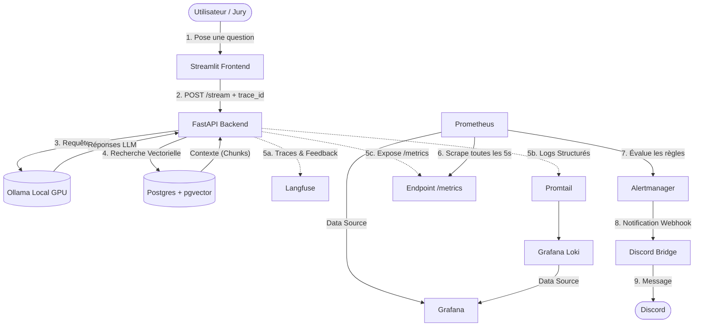

# 🧠 Simplon RAG : Carte Cognitive & Architecture Globale

L'un des défis majeurs d'une infrastructure SRE (Site Reliability Engineering) est la **charge cognitive**. Ce document sert de "carte mentale" pour comprendre comment les différents systèmes s'emboîtent, comment la donnée circule, et comment reprendre le contrôle en cas de problème.

---

## 1. Vue d'Ensemble du Flux de Données (Workflow)

L'architecture est divisée en 3 grandes couches : **Application**, **Observabilité**, et **Alerte**.



### Explication du Workflow pas à pas :
1. **L'Appel (UI → API)** : L'utilisateur pose une question. Streamlit génère un `trace_id` maître.
2. **L'Exécution (API → Ollama/Postgres)** : L'API déclenche le graphe LangGraph. Elle cherche le contexte dans Postgres, demande à Ollama de générer la réponse, puis d'évaluer sa propre réponse.
3. **L'Observabilité en Temps Réel** : 
   - Pendant l'exécution, des logs JSON sont poussés vers **Loki** (via Promtail).
   - La trace d'exécution détaillée est envoyée à **Langfuse** avec le fameux `trace_id`.
   - Des compteurs (latence, erreurs, score) sont mis à jour en mémoire et exposés sur la route `/metrics`.
4. **La Boucle de Feedback (UI → API → Langfuse)** : L'utilisateur clique sur 👍. Streamlit envoie un appel avec le même `trace_id` à l'API, qui annote la trace existante dans **Langfuse**.
5. **Le Monitoring (Prometheus → Grafana)** : **Prometheus** aspire silencieusement `/metrics` en boucle. **Grafana** lit Prometheus pour afficher les jolis graphiques.
6. **L'Alerte (Prometheus → Alertmanager → Discord)** : Si Prometheus voit que la métrique de latence P95 dépasse 10s, il déclenche une alerte vers **Alertmanager**, qui la route vers le **Discord Bridge**, qui l'envoie sur ton serveur **Discord**.

---

## 2. Dictionnaire des Composants (Qui fait quoi ?)

| Composant | Rôle Cognitif (À dire au jury) | Techniquement |
| :--- | :--- | :--- |
| **FastAPI + LangGraph** | "Le Cerveau Orchestrateur" | App Python asynchrone, API REST + Agent. |
| **Ollama** | "Le Moteur de Raisonnement" | Modèles LLM locaux (Qwen, Llama) tournant sur Metal (GPU). |
| **Postgres + pgvector** | "La Mémoire à Long Terme" | Base de données SQL stockant les chunks PDF et l'historique. |
| **Prometheus** | "L'Électrocardiogramme" | Scraper qui stocke les séries temporelles (chiffres purs). |
| **Grafana** | "Le Tableau de Bord du Pilote" | Interface visuelle unifiée pour Prometheus et Loki. |
| **Langfuse** | "La Boîte Noire du Vol" | Dashboard spécialisé LLM. Montre *pourquoi* le LLM a dit ça. |
| **Alertmanager + Discord**| "Le Beeper d'Astreinte" | Système de routage qui prévient l'équipe SRE sur son tel. |

---

## 3. Guide de Survie : Les Commandes Essentielles

Pour soulager ta mémoire pendant le Game Day, voici les seules commandes dont tu as besoin.

### 🚀 Lancement et Arrêt
Démarrer toute l'infrastructure (mode détaché) :
```bash
docker compose up -d
```
Arrêter proprement (sans perdre les données car tu as des volumes) :
```bash
docker compose down
```

### 🧹 Nettoyage (Reset complet)
Si tu as besoin de faire table rase (efface la base de données, les métriques Prometheus, etc.) :
```bash
docker compose down -v
```

### 🔍 Diagnostic Rapide (Logs)
Voir pourquoi le backend API a planté :
```bash
docker compose logs -f api
```
Voir si le pont Discord fonctionne :
```bash
docker compose logs -f discord-bridge
```
Voir si Alertmanager reçoit l'alerte de Prometheus :
```bash
docker compose logs -f alertmanager
```

### 💥 Chaos Engineering (Simuler des pannes)
*Note : Utilise ces commandes dans un autre terminal pendant que le jury regarde Grafana ou Discord.*

Simuler une base de données lente (Latence) :
```bash
curl -X POST "http://localhost:8000/api/v1/chaos/latency?ms=15000"
```
Simuler un crash du LLM (Erreur 500) :
```bash
curl -X POST "http://localhost:8000/api/v1/chaos/error?code=500"
```
Rétablir le système à la normale (Kill Switch) :
```bash
./scripts/chaos_reset.sh
```
*(Si le script n'est pas exécutable : `chmod +x scripts/chaos_reset.sh`)*

---

## 4. Astuces pour l'Oral

Si on te pose la question : *"Pourquoi avoir fait tout ça, c'est très lourd non ?"*
👉 **Ta réponse :** *"En production, le RAG est probabiliste (non déterministe). Contrairement à un CRUD classique où on sait que 2+2=4, ici le LLM peut halluciner ou prendre 20 secondes à répondre. Sans cet arsenal (Langfuse pour la trace, Prometheus pour la latence globale), nous serions aveugles. C'est l'état de l'art actuel du LLMOps."*
