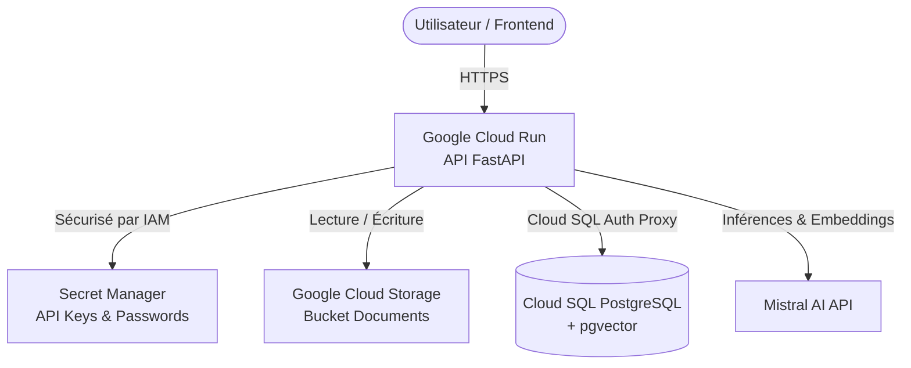

# Guide de Migration GCP - Implémentation Finale (Phase 2 & 3)

Ce document décrit l'implémentation complète et finale de l'architecture de production sécurisée pour l'API RAG Simplon sur **Google Cloud Platform (GCP)**. Il fait suite à la [Phase 1 (Artifact Registry & Docker)](GCP_MIGRATION_PHASE1.md) et détaille l'orchestration de Cloud Run, Cloud SQL, Google Cloud Storage, Secret Manager et la gestion des accès IAM.

---

## 1. Architecture de Production Cible

L'architecture s'appuie à 100% sur des services managés GCP et des APIs externes pour garantir la scalabilité, la sécurité et la maîtrise des coûts :



### Avantages de cette architecture :
* **Serverless (0 à N)** : Cloud Run met à l'échelle automatiquement l'API. En l'absence de requêtes, le service s'arrête, annulant les coûts de calcul.
* **Sécurité Zero-Trust** : Aucun secret ou mot de passe n'est stocké en clair ou dans les fichiers de configuration. Tout transite par **Google Secret Manager** et les rôles **IAM**.
* **Découplage Code/Données** : Les PDF sont stockés dans un compartiment GCS indépendant, et la base de données relationnelle indexant les chunks est hébergée sur Cloud SQL.

---

## 2. Guide d'Implémentation & Configuration Étape par Étape

### Étape 1 : Création et Configuration de Google Cloud Storage (GCS)
Le compartiment GCS héberge les documents PDF bruts. L'API les y téléversera et les y lira à la demande.

```bash
# 1. Définir le nom du bucket (doit être unique globalement)
BUCKET_NAME="simplon-rag-corpus-prod"
REGION="europe-west1"

# 2. Création du bucket avec options de classe de stockage standard et régional
gcloud storage buckets create gs://$BUCKET_NAME \
    --location=$REGION \
    --uniform-bucket-level-access
```

---

### Étape 2 : Création et Configuration de Google Cloud SQL (PostgreSQL + pgvector)
L'extension `pgvector` doit être activée pour stocker les vecteurs en dimension 1024 (Mistral AI embeddings).

```bash
# 1. Création de l'instance Cloud SQL (PostgreSQL 15) en version minimale (db-f1-micro ou shared core) pour optimiser les coûts de formation
gcloud sql instances create simplon-rag-db-instance \
    --database-version=POSTGRES_15 \
    --tier=db-f1-micro \
    --region=$REGION \
    --storage-size=10GB \
    --root-password="ChangerCeMotDePasseTresSecurisable" \
    --database-flags=cloudsql.enable_pgaudit=on

# 2. Création de la base de données applicative
gcloud sql databases create rag \
    --instance=simplon-rag-db-instance

# 3. Création de l'utilisateur applicatif dédié
gcloud sql users create rag_user \
    --instance=simplon-rag-db-instance \
    --password="MotDePasseSQLApplicatif"
```

> [!NOTE]
> L'extension `pgvector` est pré-installée sur les instances PostgreSQL de Google Cloud SQL. Elle est activée lors du premier démarrage via la migration Alembic grâce à la commande `CREATE EXTENSION IF NOT EXISTS vector;`.

---

### Étape 3 : Stockage des Secrets dans Secret Manager
Tous les secrets applicatifs sensibles doivent être conservés hors des images Docker et injectés dynamiquement au runtime.

```bash
# 1. Activer l'API Secret Manager
gcloud services enable secretmanager.googleapis.com

# 2. Créer et stocker la clé API Mistral
gcloud secrets create MISTRAL_API_KEY --replication-policy="automatic"
echo -n "VOTRE_CLE_API_MISTRAL_PROD" | gcloud secrets versions add MISTRAL_API_KEY --data-file=-

# 3. Créer et stocker le mot de passe de la base de données PostgreSQL
gcloud secrets create POSTGRES_PASSWORD --replication-policy="automatic"
echo -n "MotDePasseSQLApplicatif" | gcloud secrets versions add POSTGRES_PASSWORD --data-file=-

# 4. Créer et stocker la clé secrète JWT pour l'authentification
gcloud secrets create JWT_SECRET --replication-policy="automatic"
echo -n "UneCleJWTSuperSecretePourLaProduction" | gcloud secrets versions add JWT_SECRET --data-file=-
```

---

### Étape 4 : Gestion des Accès IAM (Moindre Privilège)
Un compte de service IAM dédié est créé pour l'API. Il n'aura que les droits stricts de lecture/écriture sur le bucket, d'accès aux secrets, et de connexion à Cloud SQL.

```bash
# 1. Création du compte de service applicatif
gcloud iam service-accounts create simplon-rag-sa \
    --description="Service account for Simplon RAG API Cloud Run service" \
    --display-name="simplon-rag-sa"

# 2. Associer le rôle de client Cloud SQL (pour se connecter via le proxy SQL)
gcloud projects add-iam-policy-binding simplon-rag-sample \
    --member="serviceAccount:simplon-rag-sa@simplon-rag-sample.iam.gserviceaccount.com" \
    --role="roles/cloudsql.client"

# 3. Associer le rôle d'accès aux Secrets
gcloud secrets add-iam-policy-binding MISTRAL_API_KEY \
    --member="serviceAccount:simplon-rag-sa@simplon-rag-sample.iam.gserviceaccount.com" \
    --role="roles/secretmanager.secretAccessor"

gcloud secrets add-iam-policy-binding POSTGRES_PASSWORD \
    --member="serviceAccount:simplon-rag-sa@simplon-rag-sample.iam.gserviceaccount.com" \
    --role="roles/secretmanager.secretAccessor"

gcloud secrets add-iam-policy-binding JWT_SECRET \
    --member="serviceAccount:simplon-rag-sa@simplon-rag-sample.iam.gserviceaccount.com" \
    --role="roles/secretmanager.secretAccessor"

# 4. Associer le rôle d'administration (lecture/écriture/suppression) sur le bucket GCS
gcloud storage buckets add-iam-policy-binding gs://$BUCKET_NAME \
    --member="serviceAccount:simplon-rag-sa@simplon-rag-sample.iam.gserviceaccount.com" \
    --role="roles/storage.objectAdmin"
```

---

### Étape 5 : Déploiement du Service sur Google Cloud Run
Nous déployons l'image construite lors de la Phase 1 en lui associant le compte de service IAM, la connexion vers Cloud SQL, les variables d'environnement non-sensibles, et les secrets.

```bash
# Déploiement Cloud Run avec configuration complète
gcloud run deploy simplon-rag-api \
    --image="europe-west1-docker.pkg.dev/simplon-rag-sample/simplon-rag-repo/api:latest" \
    --region=$REGION \
    --service-account="simplon-rag-sa@simplon-rag-sample.iam.gserviceaccount.com" \
    --add-cloudsql-instances="simplon-rag-sample:$REGION:simplon-rag-db-instance" \
    --update-env-vars="APP_ENV=production,STORAGE_PROVIDER=gcs,GCS_BUCKET_NAME=$BUCKET_NAME,POSTGRES_HOST=/cloudsql/simplon-rag-sample:$REGION:simplon-rag-db-instance,POSTGRES_USER=rag_user,POSTGRES_DB=rag,MISTRAL_CHAT_MODEL=mistral-large-latest,MISTRAL_EMBED_MODEL=mistral-embed" \
    --update-secrets="MISTRAL_API_KEY=MISTRAL_API_KEY:latest,POSTGRES_PASSWORD=POSTGRES_PASSWORD:latest,JWT_SECRET=JWT_SECRET:latest" \
    --allow-unauthenticated \
    --port=8000 \
    --memory=512Mi \
    --cpu=1
```

> [!TIP]
> Notez l'adresse de l'hôte Postgres (`POSTGRES_HOST`) définie sur `/cloudsql/simplon-rag-sample:europe-west1:simplon-rag-db-instance`. Cloud Run monte automatiquement une socket Unix de communication à cet emplacement lors de l'utilisation de l'argument `--add-cloudsql-instances`.

---

## 3. Stratégie de Hardening et Résilience Applicative

### A. Gestion du Pool de Connexions
Sur Cloud Run, les instances s'activent et s'arrêtent au gré du trafic. Si le pool est mal dimensionné, des centaines de connexions zombie peuvent saturer l'instance `db-f1-micro`.
* Le code applicatif dans [session.py](../api/src/rag/db/session.py) utilise les variables `db_pool_size=5` et `db_max_overflow=10` pour éviter d'inonder Cloud SQL.
* Le paramètre `pool_recycle=1800` (30 minutes) est configuré pour nettoyer proprement les connexions inactives.

### B. Gestion des Fichiers Temporaires et Fuites Mémoires
Puisque Cloud Run utilise un conteneur en lecture seule à l'exception du système `/tmp`, toute ingestion de document télécharge temporairement le PDF localement.
* L'implémentation de la route `/ingest-pdf` encapsule l'écriture et le parsing dans un bloc `try...finally` garantissant que le fichier téléchargé dans `/tmp/` est supprimé immédiatement après l'ingestion, prévenant toute saturation de la mémoire vive (RAM) du conteneur.

### C. Économies Financières des Requêtes d'Embeddings
Pour minimiser l'appel à l'API Mistral AI (générateur d'embeddings payant) :
* L'application calcule le hash **SHA-256** du document PDF ou du contenu textuel.
* Si le hash est trouvé dans le schéma SQL indexé (`file_hash`), l'ingestion s'interrompt immédiatement avec un status success, évitant de repayer pour des embeddings identiques.

---

## 4. Script de Validation de la Production

Pour tester de bout en bout la validité de la migration finale vers GCP :

1. Remplacez localement vos variables dans le fichier `.env` par les valeurs de production GCP.
2. Exécutez le script de validation qui effectuera le flux complet (Stockage GCS -> Ingestion PG -> Embedding Mistral -> Requête agent -> Ragas évaluation) :

```bash
# Installer les dépendances et exécuter le script
uv run python scripts/validate_rag.py
```

3. Observez la console de log pour valider la réussite de chaque étape. Si une erreur de droit IAM survient, reportez-vous aux logs d'audit GCP de Secret Manager ou de GCS.
